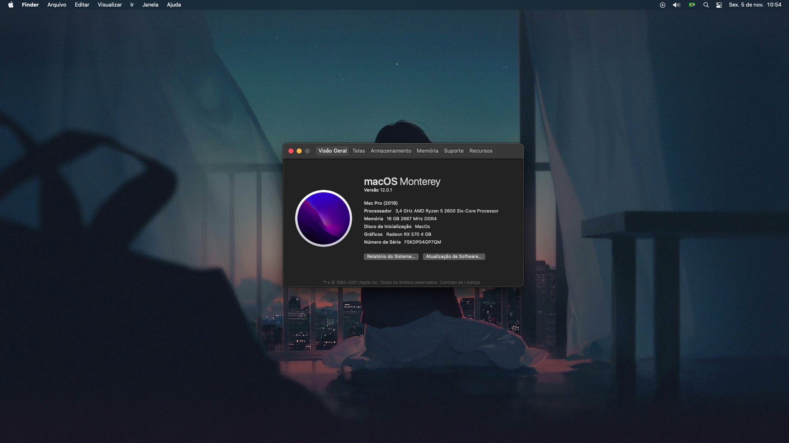

# ryzentosh-asrock-a320m-rx570-Big-Sur

CPU: Ryzen 5 2600

GPU: Rx 570

16gb ram

Nvme xray disk 256gb <<(Windows 10)

Kingston ssd 110gb <<(Monterey 12.0.1)

Opencore 7.5
Monterey 12.0.1

Followed dortania guides. step by step
Disable Above 4G decoding in Bios
Disable CSM

