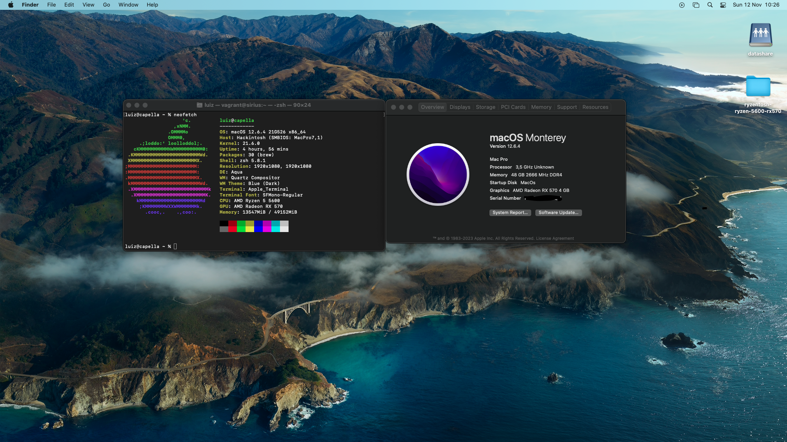

# ryzentosh-R5-5600-rx570-Monterey

### Hardware

CPU: Ryzen 5 5600

GPU: Rx 570

RAM: 48gb

### Software

Opencore 9.6

Branch main: Monterey 12.6.4

Branch big_sur: Big Sur 11.3.0

### Bios:

Enable Above 4G decoding
Disable CSM

Followed dortania guides. step by step

Dont forget to generate your own serial.

